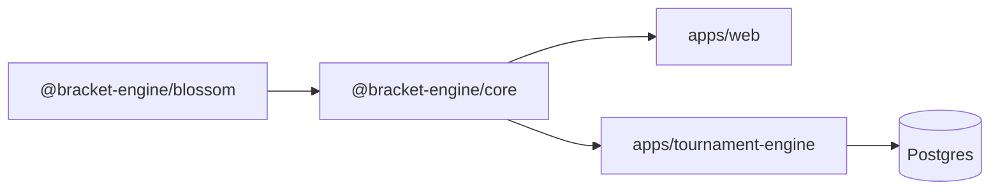

# Architecture

Arrows are imports. Packages never import apps. Apps never import each other.

## Packages

| Package   | Exports                                                                                                                                                                                                                                                                                                             | Depends on |
| --------- | ------------------------------------------------------------------------------------------------------------------------------------------------------------------------------------------------------------------------------------------------------------------------------------------------------------------- | ---------- |
| `blossom` | `blossom(edges, maxCardinality)`: maximum-weight matching on a weighted graph                                                                                                                                                                                                                                       | nothing    |
| `core`    | `generateSeeding`, `generateSingleElimination`, `generateDoubleElimination`, `generateGrandFinal`, `propagateByes`, `advanceWinner`, `reopenMatch`, `generateSwissRound`, `calculateRecommendedRounds`, `buildSwissStandings`, `calculateMantisRankings`, `calculateEliminationStandings`, and the types they share | `blossom`  |

`core` is organised as `brackets/` (elimination), `swiss/` (pairing and standings) and
`seeding.ts`. Every function takes and returns plain objects. A `BracketMatch` carries
its slots, its winner, and the match numbers it feeds into, so advancing a winner is a
pure transform over the match list.

## Apps

| App                 | Composes                                                             | Adds                                                                                                             |
| ------------------- | -------------------------------------------------------------------- | ---------------------------------------------------------------------------------------------------------------- |
| `web`               | Everything `core` exports, in the browser                            | The playground: pick a field size and format, click winners, reopen, undo, cut to top N                          |
| `tournament-engine` | Bracket generation, advancement, reopening, Swiss pairing, standings | Postgres schema, per-phase locks, participant drops and forfeits, top cuts, final standings across phases, a CLI |

## Boundaries

The packages never know about persistence, identity or transport. Participants are
seeds or opaque ids. Matches are numbered, not keyed.

The example app owns state. `src/db/` holds the Drizzle schema and the one place env is
read. `src/engine/` maps stored rows to package input, calls the package, and writes the
result back inside a transaction that holds a lock on the phase. `src/cli/` is a thin
argument parser over `src/engine/tournament.ts`.

## Promotion path

A module in `apps/tournament-engine` moves to `packages/<module>` when a second app imports
it. Until then it stays in the app.
